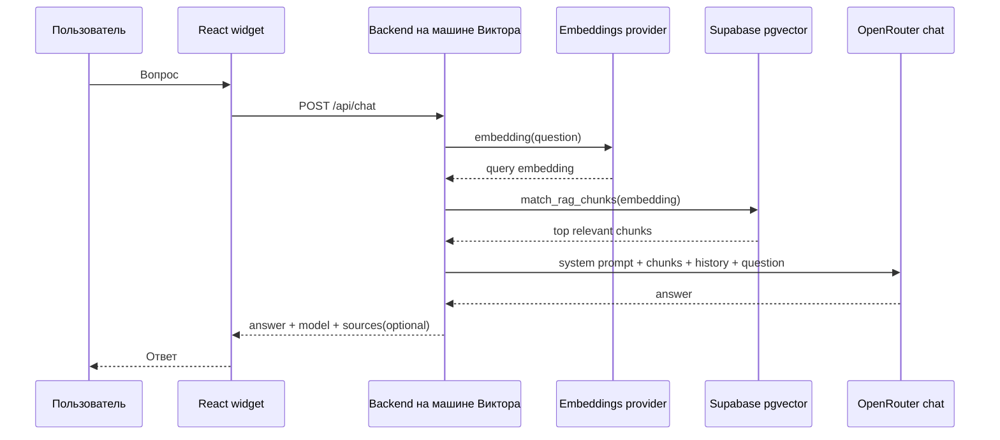
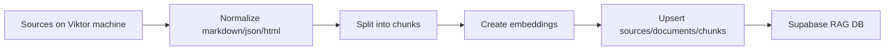

# Архитектура Supabase RAG для чатбота РИК

## Цель

Сделать облачную RAG-память для небольшого чатбота сайта РИК, чтобы:

- знания жили отдельно от frontend;
- секреты хранились только на сервере Виктора;
- агенты могли обновлять базу знаний;
- бот отвечал по материалам РИК и честно признавал нехватку данных;
- систему можно было вставить в основной сайт без локальной зависимости от машины Codex.

## Поток ответа



## Поток загрузки знаний



## Источники знаний

Стартовые источники сейчас:

- `knowledge/00-rik-company-and-sales.md`
- `knowledge/10-product-catalog.md`
- `knowledge/20-pages-core-and-central.md`
- `knowledge/21-pages-fans.md`
- `knowledge/22-pages-duct-and-air-treatment.md`
- `knowledge/23-pages-valves-and-ductwork.md`
- `knowledge/24-pages-special-equipment.md`
- `knowledge/90-data-caveats-and-source-rules.md`

Дальше источниками правды становятся материалы на машине Виктора:

- актуальная версия сайта;
- ТЗ;
- каталоги;
- сертификаты;
- BIM/проектировочные материалы;
- решения Виктора;
- сообщения через `site-bridge`, если они утверждены как источник.

## Таблицы

### `rag_sources`

Описывает источник: файл, архив, страница сайта, документ, ручная заметка.

### `rag_documents`

Нормализованный документ, который можно разбить на чанки.

### `rag_chunks`

Маленькие фрагменты текста с embedding. Основная таблица поиска.

### `rag_ingest_runs`

Журнал загрузок: что загрузили, когда, сколько чанков, были ли ошибки.

## Retrieval

Первый production-поиск:

1. Посчитать embedding вопроса.
2. Вызвать `match_rag_chunks`.
3. Взять `top_k` фрагментов.
4. Отфильтровать по `similarity_threshold`.
5. Добавить в prompt только компактные фрагменты с source title.

Рекомендуемые стартовые значения:

```env
RAG_TOP_K=8
RAG_SIMILARITY_THRESHOLD=0.25
RAG_MAX_CONTEXT_CHARS=12000
RAG_CHUNK_MAX_CHARS=1200
RAG_CHUNK_OVERLAP_CHARS=180
```

## Prompt context format

В prompt лучше передавать так:

```text
Project knowledge snippets:

[1] Source: 10-product-catalog.md
Вентиляторы: KRV, KRV-V, RR, KR, VR, WR, WRN...

[2] Source: 00-rik-company-and-sales.md
Основной смысл сайта: получение заявок на расчет проекта...
```

Модель должна понимать: если факта нет в snippets, она не должна выдумывать.

## Sources в ответе

Пользователю можно не показывать источники по умолчанию. Но backend может вернуть их в debug/admin-режиме:

```json
{
  "answer": "...",
  "sessionId": "...",
  "model": "...",
  "sources": [
    {
      "title": "10-product-catalog.md",
      "chunkId": "...",
      "similarity": 0.72
    }
  ]
}
```

Во frontend это лучше пока не выводить, чтобы не раскрывать служебную структуру.

## Security

- `SUPABASE_SERVICE_ROLE_KEY` только backend.
- `OPENROUTER_API_KEY` только backend.
- Frontend получает только `/api/chat`.
- RLS можно включить, но backend с service role обходит RLS. Для будущей админки нужно отдельное проектирование прав.
- Не хранить лишние персональные данные в RAG. Заявки и история чата — отдельная подсистема, не knowledge base.

## Что можно сделать позже

- Админ-страницу обновления знаний.
- Версионирование документов.
- Автоматический ingestion из папки на машине Виктора.
- Отдельные namespaces: `site`, `bim`, `certificates`, `sales`, `internal-approved`.
- Hybrid search: pgvector + full-text search по русскому языку.
- Reranker, если появится качество/бюджет.

